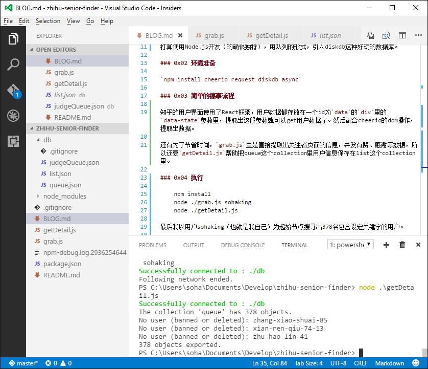

# 知乎高中生寻找计划

### 0x00 为啥要搞这个

今天吃晚饭的时候刷知乎刷到了[千赞以上99/00后答主及其高赞回答 一览](https://zhuanlan.zhihu.com/p/25082065)，最后发现施子怡大大是“人肉搜索”，于是打算借助神秘的程序力量找出一部分。

### 0x01 构思

知乎不是使用数字id展示个人页面，因此我决定使用通过一个人的关注者来爬，我觉得我们总会关注一些自己同龄人的动向。（因为我就是啊）关于符合要求的人的判断，因为知乎并没有生日的选项（就算有也会有很多人不填写或者填写假的吧），我打算通过找关键字的方法。比如`高一|高二|高三|高中学生|00后`等等。

打算使用Node.js开发（的确很独特），用队列的形式，引入diskdb这种好玩的数据库。

### 0x02 环境准备

`npm install cheerio request diskdb async`

### 0x03 简单的搞事流程

知乎的用户界面使用了React框架，用户数据都存放在一个id为`data`的`div`里的`data-state`参数里，提取出这段参数就可以get用户数据了。然后配合cheerio的dom操作，提取出数据。

还有为了节省时间，`grab.js`里是直接提取出关注者页面的信息，并没有赞、感谢等数据，所以还要`getDetail.js`帮助把queue这个collection里用户信息保存在list这个collection里。

### 0x04 执行

    npm install
    node ./grab.js sohaking
    node ./getDetail.js

最后我以用户sohaking（也就是我自己）为起始节点搜寻出378名包含设定关键字的用户。

### 0x05 其他的

相关源码公布在GitHub：

知乎专栏：[https://zhuanlan.zhihu.com/p/25092211](https://zhuanlan.zhihu.com/p/25092211)
